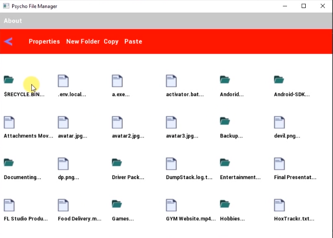

# Psycho File Manager
This is File Manager written in C++ as part of my Semester Project

# Features
- Navigating files and folders
- Can open files (videos, images and text files for now)
- See Details of files
- Copy and Paste files
- Can create new folder

# DEMO

# Notes
- SMFL library is used to make GUI.
- For Accessing windows files, I use WINDOWS API.

Due to time constraints and the urgency of the project deadline (I have to complete it in less than one day), the code files currently appear messy.

You can improve the readability of the code. by organizing files, improving comments, and adhering to best practices to make the codebase more accessible to others and future contributors.
